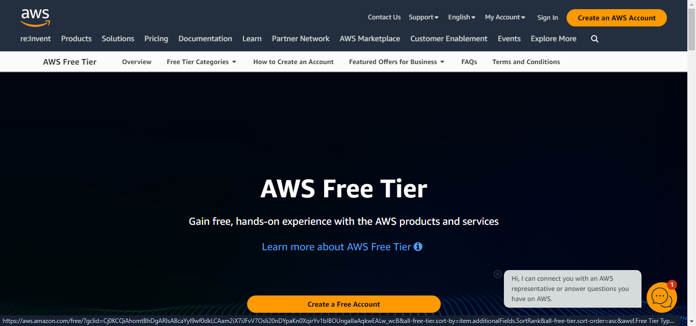

# Terraform-Essentials

This repo will guide us on IAC,the basics of setting up and using the tool Terraform on AWS.

## Definition of Infrastructure as Code

Infrastructure as Code (IaC) is a concept and practice in software engineering and system administration that involves managing and provisioning computing infrastructure through machine-readable script files, rather than through physical hardware configuration or interactive configuration tools. The idea is to treat infrastructure configurations as code, applying software development practices to infrastructure management.

## Key aspects of Infrastructure as Code include:

**Declarative Configuration** : IaC relies on declarative rather than imperative code. Instead of specifying step-by-step instructions on how to achieve a particular configuration, you declare the desired state of your infrastructure, and the IaC tool takes care of figuring out how to make it happen.

**Version Control**: IaC scripts are typically stored in version control systems (like Git), allowing teams to track changes, roll back to previous versions, and collaborate effectively.

**Reusability** : Code can be modularized and reused, promoting consistency across different environments and making it easier to manage complex infrastructure configurations.

**Automation** : IaC tools automate the process of provisioning and configuring infrastructure, reducing manual errors, and increasing efficiency. This can be particularly valuable in the context of continuous integration and continuous delivery (CI/CD) pipelines.

**Idempotency**: IaC should be idempotent, meaning that applying the same configuration multiple times results in the same outcome as applying it once. This property ensures that you can repeatedly apply the configuration without unintended side effects.

Common IaC tools include:

- Terraform: A popular open-source tool by HashiCorp that supports multiple cloud providers and on-premises infrastructure.

- Chef: An automation platform that manages infrastructure as code. It uses a Ruby-based DSL (Domain-Specific Language) for writing configuration scripts.

- Puppet: Another configuration management tool that uses its own DSL for defining infrastructure configurations.

## Terraform Workflow

The Terraform workflow involves a set of steps and best practices for using Terraform, an Infrastructure as Code (IaC) tool, to provision and manage infrastructure. 

Here's a common Terraform workflow:

Initialize the Working Directory:

- Run `terraform init` in the directory containing your Terraform configuration files (*.tf). This command initializes your working directory, downloads any required providers, and sets up the backend.

## Write Terraform Configuration:

Define your infrastructure using Terraform's HashiCorp Configuration Language (HCL) in one or more .tf files. Declare resources, providers, variables, and any other necessary configurations.

## Plan the Infrastructure:

Run `terraform plan` to create an execution plan. This command shows what Terraform will do when you apply the configuration, including creating, modifying, or destroying resources.

## Review the Plan:

Review the output of the terraform plan command to ensure that it aligns with your expectations. It provides information on what changes will be made to your infrastructure.

## Apply Changes:

If you are satisfied with the plan, apply the changes using terraform apply. This command prompts for confirmation before making any changes and also allows you to specify variables if needed.

## Review and Confirm:

Review the proposed changes one more time and confirm by typing "yes" when prompted. Terraform will then execute the planned changes.

## Infrastructure Provisioning:

Terraform will create, modify, or delete resources based on the configuration provided. During this phase, the infrastructure is provisioned or updated.

## Output Information:

After applying changes, Terraform provides output information, such as the IP addresses, DNS names, or other relevant details about the created resources.

## Destroy Infrastructure (Optional):

If you want to tear down your infrastructure, you can use `terraform destroy`. Be cautious with this command, as it will delete all resources defined in your configuration.

## Version Control and Collaboration:

Store your Terraform configuration files in version control (e.g., Git) to track changes and collaborate with team members. This helps in maintaining a history of infrastructure changes and facilitates collaboration.

## Continuous Integration (Optional):

Integrate Terraform into your continuous integration (CI) pipeline to automate testing and deployment. This ensures that your infrastructure code is validated and applied consistently.

## Manage State:
Terraform uses a state file to keep track of the current state of your infrastructure. Consider storing this state file remotely using a backend like AWS S3, Terraform Cloud,Terraform Cloud, Azure Blob Storage, Google Cloud Storage, Alibaba Cloud OSS, and more to enable collaboration and provide better state management.

Remember that Terraform is a powerful tool, and it's crucial to understand the implications of your changes before applying them, especially in production environments. Always follow best practices for infrastructure as code and version control to ensure reliability and maintainability.

### Getting started with Terraform on AWS

Prerequsites
- Open a [Free tier AWS ACCOUNT](https://www.googleadservices.com/pagead/aclk?sa=L&ai=DChcSEwjorIqu_dmDAxXxmVAGHSFcB2YYABAAGgJkZw&ase=2&gclid=Cj0KCQiAhomtBhDgARIsABcaYyl9wf0dkLCAam2iX7iJFvV7OsIi20nDYpaKn0XqirYv1bIBOUngalIaAqkwEALw_wcB&ohost=www.google.com&cid=CAESVeD2B-fYZPRIL2hoqWUN7cE_0oIcLFL_hW7QY0Oa3yxTP4H6Sdwv4ljgs0mU1JtCT6n3fqWTkTx5q1AuyERV3fmCTIeAc5TxqrPVo51-uWGGpNSv4r8&sig=AOD64_05Ze_Vp61vfvWSpBes3G5E0tarOA&q&nis=4&adurl&ved=2ahUKEwiO-4Su_dmDAxV0U0EAHbG7DOYQ0Qx6BAgNEAE)

- Create an [IAM User](https://docs.aws.amazon.com/IAM/latest/UserGuide/id_users_create.html)
 - Create access key and secret key for new user 

- Install [Chocolatey](https://chocolatey.org/install)

- Download AWS CLI
 `choco install awscli -y`

- Configure AWS with new IAM user

- Install git
`choco install git -y`

- Install Vscode
`choco install vscode -y`

## Start

